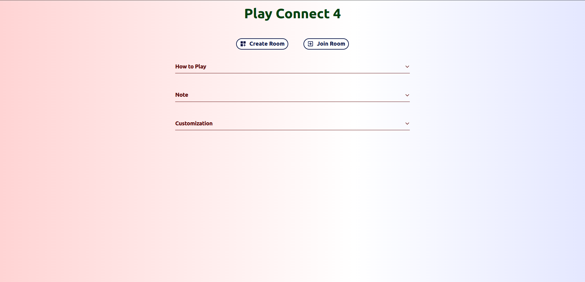
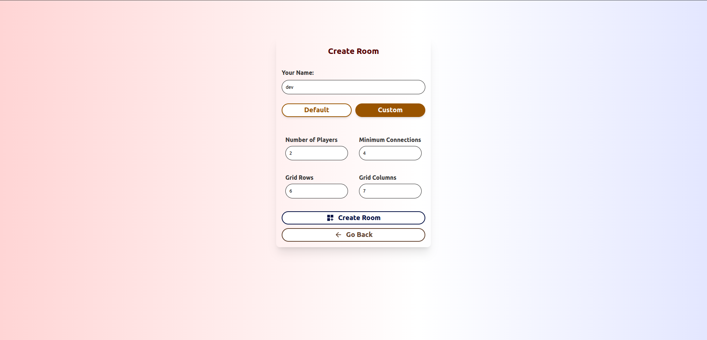
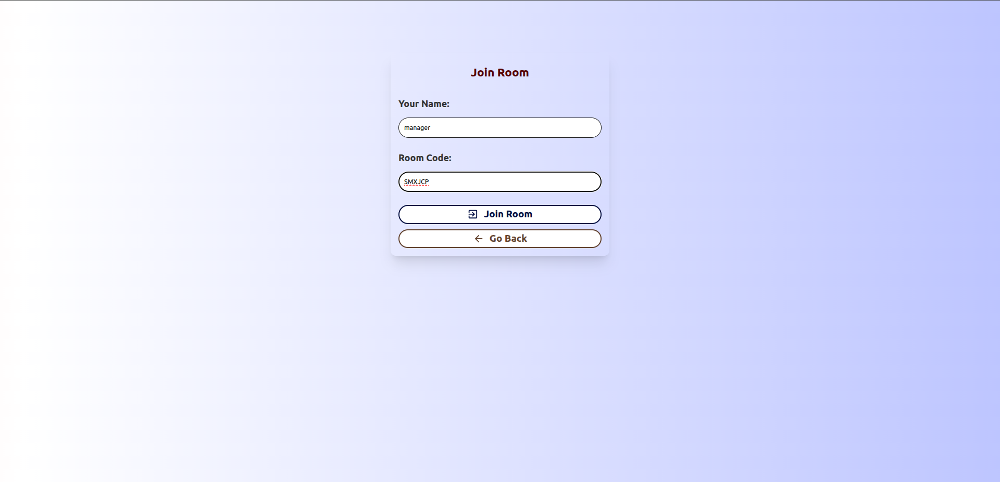
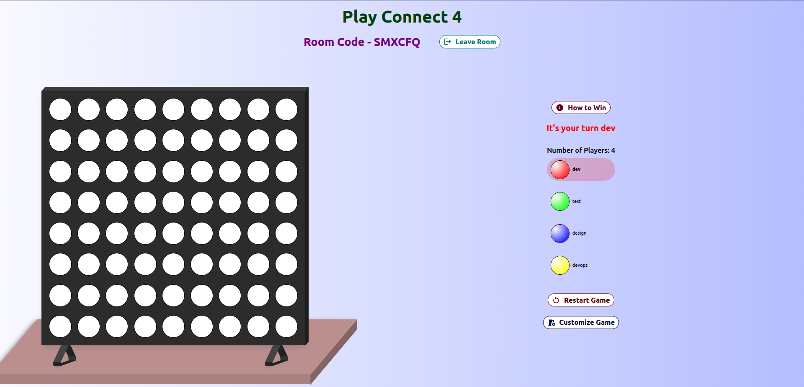
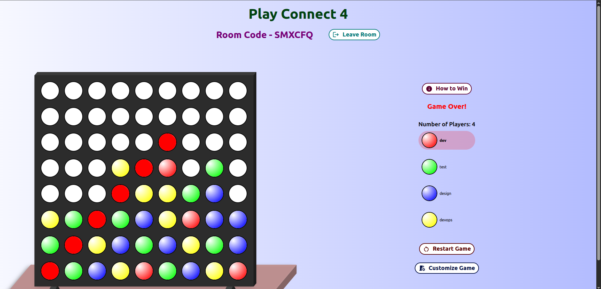
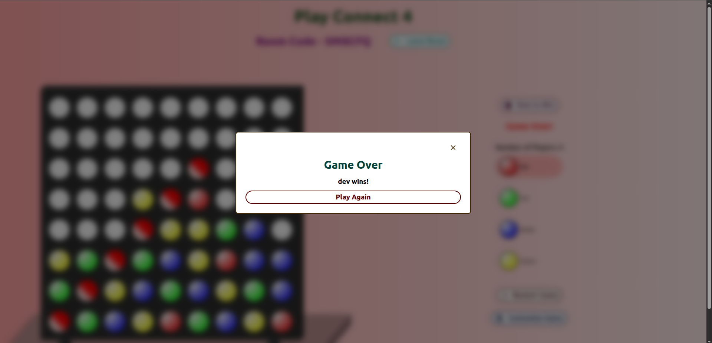

# Connect 4

A real-time, multiplayer take on the classic Connect 4. Create a room, share the
code, and drop discs with friends across separate devices. Line up your discs
before anyone else and the board lights up your win. Fancy a bigger challenge?
Customize the grid, the number of players, and how many discs it takes to win.

## Play Now

▶️ **[Play Connect 4 Online](https://connect-4-game-online.vercel.app)**

## Screenshots

|                                                 |                                               |
| ----------------------------------------------- | --------------------------------------------- |
|             |  |
| _Home_                                          | _Create a room_                               |
|        |   |
| _Join a room_                                   | _In-game board_                               |
|  |        |
| _Finished game_                                 | _Game over_                                   |

## How to Play

- **Create or join a room.** Start a new match to get a unique room code, or
  enter a friend's code to join theirs.
- **Share the code.** Send your room code to the other player(s) so they can
  join the same board.
- **Take turns.** Once everyone has joined, players take turns dropping a disc
  into any column. Discs fall to the lowest open cell.
- **Connect to win.** Line up your discs — horizontally, vertically, or
  diagonally — before your opponents. The default target is four in a row.

Each player is assigned a color when they join, and the board highlights the
current turn so you always know who's up.


> Mobile tip: for the best view, switch your browser to desktop mode.

## Customization

When creating a room, pick **Default** for the classic 6×7, two-player, connect-4
setup, or choose **Custom** to tune the match:

| Setting                    | Range                   | Default |
| -------------------------- | ----------------------- | ------- |
| Number of players          | 2–8                     | 2       |
| Minimum connections to win | 4 to min(rows, columns) | 4       |
| Grid rows                  | 6–10                    | 6       |
| Grid columns               | 7–10                    | 7       |

Settings can also be adjusted from inside a room. Changing the board dimensions
resets the current game so everyone starts fresh.


## Multiplayer

- Games run in real time — every move syncs instantly to all players in the
  room through Firestore.
- Rooms support 2 to 8 players, each with their own color.
- Players are signed in anonymously, so there's no account setup.
- When a player leaves, the others are notified. If the last player leaves, the
  room is cleaned up automatically.
- Sound effects play for drops, wins, losses, and draws.

## Tech Stack

Built as a single-page React app. Versions reflect `package.json`.

| Purpose                 | Technology                              | Version  |
| ----------------------- | --------------------------------------- | -------- |
| UI                      | `react` / `react-dom`                   | ^19.1.0  |
| Language                | `typescript`                            | ~5.7.2   |
| Build tooling           | `vite` + `@vitejs/plugin-react-swc`     | ^6.3.1   |
| Routing                 | `react-router-dom`                      | ^7.6.0   |
| Backend / realtime data | `firebase` (Firestore + Auth)           | ^11.7.1  |
| Styling                 | `tailwindcss` + `@tailwindcss/vite`     | ^4.1.5   |
| Components / icons      | `@mui/material` + `@mui/icons-material` | ^7.1.0   |
| Animation               | `framer-motion` / `motion`              | ^12.12.1 |
| Linting                 | `eslint`                                | ^9.22.0  |

## Project Information

- Single-page React app with a Firebase (Firestore) backend for real-time state.
- Players authenticate anonymously through Firebase Auth.
- Game state (board, players, turn, winner, settings) lives in a Firestore
  `rooms` document and syncs to every client via a live snapshot listener.
- Routing is handled by React Router across the home, create-room, join-room,
  and in-room game screens.

### Prerequisites

- Node.js 18+
- A Firebase project with Firestore and Anonymous Authentication enabled.

### Environment Variables

The app reads Firebase config from Vite environment variables. Create a `.env`
file in the project root with your project's values:

```bash
VITE_FIREBASE_API_KEY=your_api_key
VITE_FIREBASE_AUTH_DOMAIN=your_project.firebaseapp.com
VITE_FIREBASE_PROJECT_ID=your_project_id
VITE_FIREBASE_STORAGE_BUCKET=your_project.appspot.com
VITE_FIREBASE_MESSAGING_SENDER_ID=your_sender_id
VITE_FIREBASE_APP_ID=your_app_id
```

### Run Locally

```bash
npm install     # install dependencies
npm run dev     # start the dev server (default http://localhost:5173)
npm run build   # type-check and build for production to dist/
npm run preview # preview the production build
npm run lint    # run eslint
```

## Architecture

A brief map of how it fits together:

- **Rooms** — each game is a Firestore document under `rooms/{roomCode}`, holding
  the board, players and their colors, current turn, winner, winning cells, and
  game settings. Room codes are random 6-letter strings.
- **Realtime sync** — the in-room screen (`components/pages/Connect4.tsx`)
  subscribes to its room with `onSnapshot`, so board updates, joins, leaves, and
  wins propagate to every client immediately.
- **Moves** — dropping a disc calls `playMove` in `firebase/service.ts`, which
  validates the turn, places the disc in the lowest open cell of the column,
  checks for a win, and advances the turn — all as a single Firestore update.
- **Win detection** — `utils/isWinner.ts` walks outward from the last move in
  four directions (horizontal, vertical, both diagonals) and returns the winning
  cells when the run reaches the room's connect count.
- **Players & colors** — colors are shuffled from a fixed palette
  (`getShuffledColors`) when a room is created and assigned to players by index
  as they join.
- **Settings** — board size, player count, and connect count are set at creation
  and can be updated live; changing dimensions resets the board.
- **Feedback** — `utils/sounds.ts` plays drop, win, lose, and draw effects, and a
  result screen summarizes the outcome when the game finishes.
